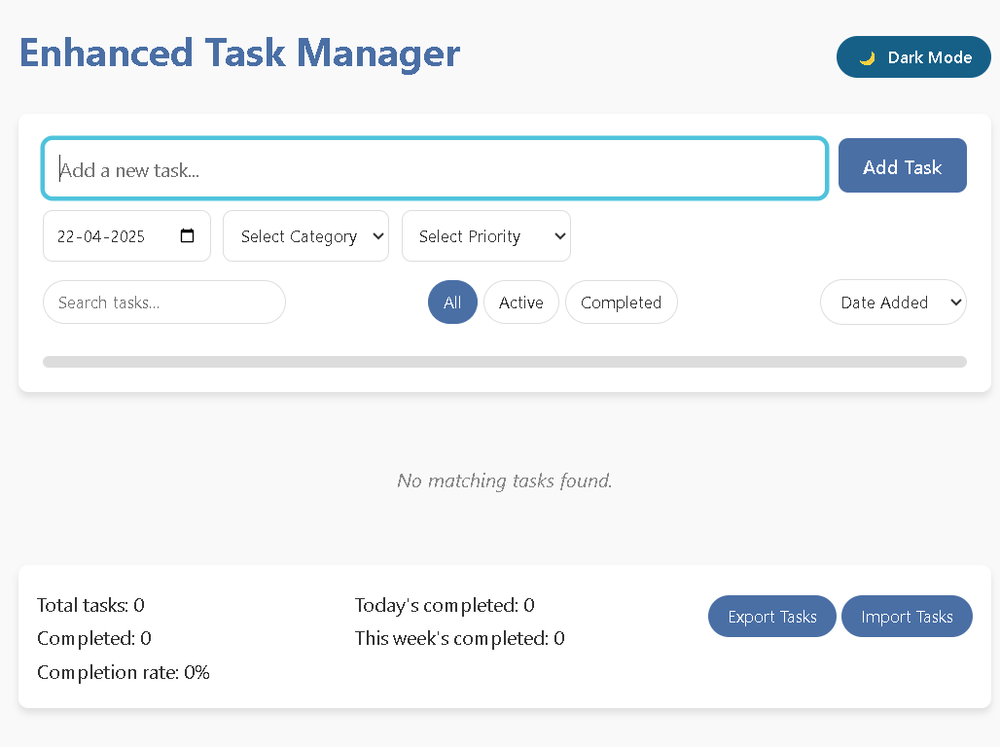
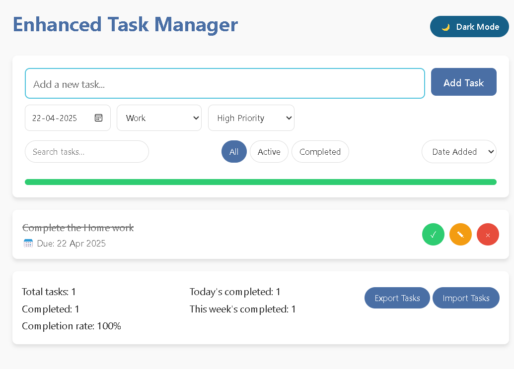

# ✅ To-Do List App

[](https://github.com/eswarsamanthula/To-Do-List-App/stargazers)
[](https://github.com/eswarsamanthula/To-Do-List-App/network/members)
[](https://github.com/eswarsamanthula/To-Do-List-App/issues)
[](https://github.com/eswarsamanthula/To-Do-List-App/blob/main/LICENSE)

A simple and clean To-Do List web app to organize your daily tasks. Built with vanilla HTML, CSS, and JavaScript. Live and deployed on GitHub Pages.

🔗 **Live Demo:** [eswarsamanthula.github.io/To-Do-List-App](https://eswarsamanthula.github.io/To-Do-List-App)

---

## ✨ Features

- ➕ Add new tasks  
- ✅ Mark tasks as completed  
- 🗑️ Delete tasks  
- 💾 LocalStorage support *(optional if implemented)*  
- 📱 Responsive design for all screen sizes

---

## 📸 Screenshots

### 📌 Home Screen



### ✅ Task Completed Example



> 📁 Place your images inside a `screenshots/` folder in your repo for these to work correctly.

---

## 📅 Roadmap

- [x] Basic Task Add/Delete
- [x] Mark tasks as completed
- [x] Edit task functionality ✏️
- [x] Dark mode toggle 🌙
- [x] Task filtering (All, Active, Completed)
- [ ] Backend integration (Firebase/Node.js) for persistent data

---

## 🛠️ Tech Stack

- HTML5
- CSS3
- JavaScript (Vanilla)
- GitHub Pages (for hosting)

---

## 📂 Project Structure

📦 To-Do-List-App ┣ 📜 index.html ┣ 📜 style.css ┣ 📜 script.js ┣ 📁 screenshots/ ┃ ┣ 📸 home.png ┃ ┗ 📸 completed.png ┗ 📜 README.md

## 🚀 Getting Started

### Clone the repository

```bash
git clone https://github.com/eswarsamanthula/To-Do-List-App.git
cd To-Do-List-App

```
## Run locally
Open index.html in your browser — no build tools or setup required!

## 🙌 Contributing
Pull requests are welcome! If you have ideas or spot bugs, feel free to open an issue or fork the project.

## 📬 Contact
Created by Eswar Samanthula
📧 Email: eswarsamanthulas@gmail.com
